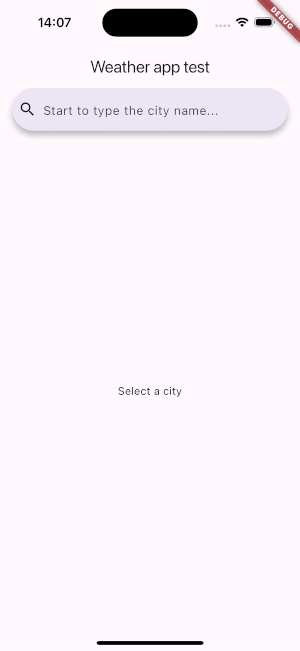

# Weather Test

This is a test assignment for Duomo. The design, text, etc. are not important; the main requirement is to have the described functionality. The architecture should be designed as if it's a part of a future large application, without simplifying it due to the simplicity of the concept.

## Description

A simple weather application with a single screen containing a search bar. Users can enter a city in the search bar, and a dropdown list of cities will appear, narrowing down as the user types. After selecting a city, the temperature in that city for today will be displayed below the search bar.

## Features

- Search for cities with an autocomplete feature.
- Display current temperature for the selected city.
- Uses REST API for weather information and city search.

# Demo



## Potential Improvements

### Error Handling:
    - Improve error handling to provide meaningful error messages to the user in case of API failures or network issues.

### Localization:
    - Add support for multiple languages to cater to a wider audience.

### Testing:
    - Write unit tests and integration tests to ensure the reliability and stability of the application.

## Installation

1. Clone the repository:
    ```sh
    git clone git@github.com:IliaKhuzhakhmetov/WeatherAppTest_Duomo.git
    ```

2. Install the dependencies:
    ```sh
    flutter pub get
    ```

3. Create a `.env` file in the root directory with your API keys:
    ```env
    OPENWEATHER_API_KEY=your_openweather_api_key
    AMADEUS_API_KEY=your_amadeus_api_key
    ```

4. Run the application:
    ```sh
    flutter run
    ```

## Dependencies

- Dio, oauth2 (for HTTP requests)
- BLoC (for state management)
- Flutter_dotenv (for environment variables)

## Usage

1. Open the application.
2. Start typing the name of a city in the search bar.
3. Select the city from the dropdown list.
4. The current temperature for the selected city will be displayed below the search bar.


